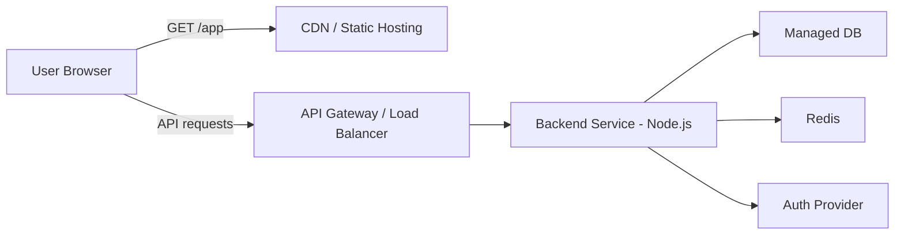
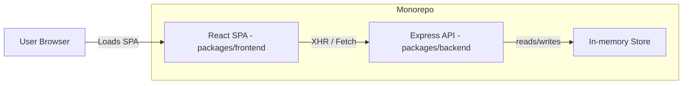
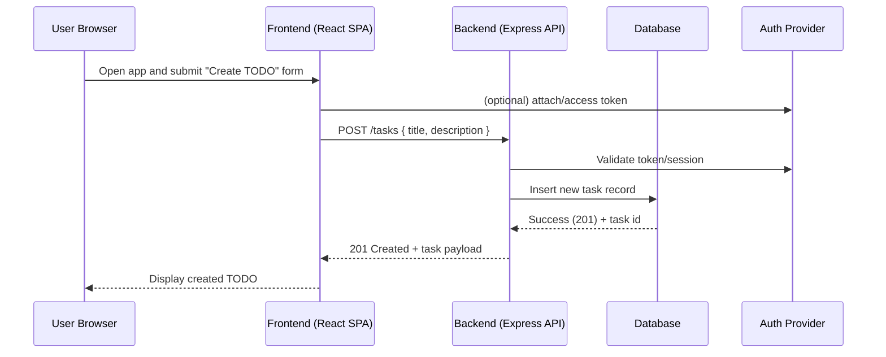

# Cloud Architecture Overview

## Purpose

This document provides a high-level overview of the cloud architecture for the TODO application used in this repository. It describes components, deployment patterns, scaling recommendations, and security considerations to guide development and operations.

## Scope

Covers the hosted services for the frontend and backend, data storage, authentication, CI/CD, monitoring, and basic operational practices. It is intentionally platform-agnostic but includes concrete examples for common cloud providers (AWS/GCP/Azure).

## High-level Components

- Frontend: Single-page React app (packages/frontend) served via a CDN or static web hosting.
- Backend API: Node.js/Express service (packages/backend/src) exposing REST endpoints for tasks and users.
- Database: Managed relational or document DB (Postgres, MySQL, or managed MongoDB) for persistence.
- Caching: Optional in-memory cache (Redis) for read-heavy endpoints and rate-limiting counters.
- Object Storage: For any uploaded assets, use S3-compatible buckets.
- Authentication: OAuth2/OIDC provider or managed identity service (Auth0, Firebase Auth, AWS Cognito).
- CI/CD: GitHub Actions or cloud-native pipelines to build, test, and deploy artifacts.
- Observability: Centralized logs, metrics, and error tracking (e.g., CloudWatch / Stackdriver / Azure Monitor + Sentry).

## Deployment Pattern

- Frontend
  - Build static artifacts (npm run build) and publish to a CDN-backed static host (S3 + CloudFront, GCS + Cloud CDN, or Azure Static Web Apps).
  - Invalidate CDN cache on deploy or use cache-busting filenames.

- Backend
  - Containerize service and deploy to a managed container service (ECS/Fargate, Google Cloud Run, Azure App Service) or Kubernetes (EKS/GKE/AKS) for larger scale.
  - Use environment variables (or a secrets manager) for configuration.
  - Expose API behind an Application Load Balancer / API Gateway with TLS.

- Database & Caching
  - Use managed database instances with automated backups and multi-AZ/region replicas for production availability.
  - Provision Redis as a managed service for session caching or rate-limiting.

## Network & Security

- Use TLS everywhere (HTTPS) with valid certificates managed by the provider or via Let's Encrypt.
- Restrict database access to backend instances via VPC/subnet and security groups.
- Store secrets in a secrets manager (AWS Secrets Manager, GCP Secret Manager, Azure Key Vault).
- Apply least-privilege IAM roles to services.
- Rate limit API endpoints and enable WAF rules for common attack patterns.

## Scaling & Availability

- Frontend: CDN provides global distribution and scales automatically.
- Backend: Start with autoscaling containers (based on CPU/memory or request latency) and add horizontal pod autoscaling in Kubernetes when needed.
- Database: Scale vertically for smaller loads and add read replicas for read-heavy workloads.
- Design for graceful degradation: cache responses, enforce timeouts, and use retry/backoff strategies.

## CI/CD Recommendations

- Build and test on PRs; require passing tests before merge.
- Use semantic versioning and immutably-tagged container images.
- Deploy to staging on merge to `main` (or a staging branch), and require automated integration tests before promoting to production.
- Keep infrastructure as code (Terraform, CloudFormation, or ARM/Bicep) in a separate `infra/` directory or repo.

## Observability & Ops

- Capture structured logs and forward to a centralized logging platform.
- Emit metrics (request counts, latencies, error rates) to a metrics backend and set alerts for SLO breaches.
- Integrate error monitoring (Sentry/Rollbar) and track key user flows for regressions.
- Define runbook playbooks for common incidents (DB failover, rolling back deployments, certificate renewal).

## Cost Considerations

- Use managed services to reduce operational overhead, but monitor costs for idle resources.
- Use autoscaling and reserved/spot instances where appropriate.
- Archive or downscale non-production environments when idle.

## Example Minimal Architecture (Mermaid)

## System Context (Monorepo)

Simple system context diagram for this repository showing the React frontend, Express API, and an in-memory store used during development or testing.

## User Flow: Create TODO (Mermaid Sequence)

## Next Steps

- Add provider-specific deployment guides (AWS/GCP/Azure) and example IaC templates.
- Add a secrets and key rotation policy to the security docs.
- Add SLOs and monitoring dashboards for key endpoints.

---

Document created for the `TODO` sample application in this repository.
